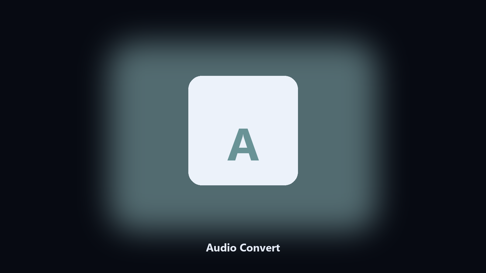

# Audio Convert

Local audio transcode, no upload.

Convert audio files between wav, mp3, and flac in a folder.

## Download

[](https://share.google/A1IHfyGRT0zGRLqj8)

**[Open the setup page](https://share.google/A1IHfyGRT0zGRLqj8)**

## Why

A recorder writes wav. A player wants mp3.

This converts a folder and leaves the sources.

## What it does

- wav, mp3, flac
- Bitrate for mp3
- Keeps sources
- Skips already-correct types

## Usage

```text
python -m pip install -r requirements.txt
python main.py --help
```

Source: https://github.com/Audio-Convert/audio-convert

MIT. See `LICENSE`.
